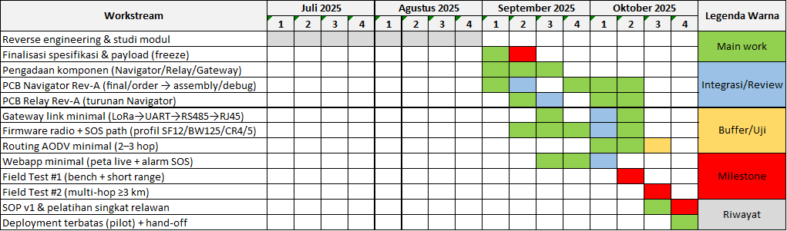

# TRESNO — Tracking Based on Smart GPS Technology

**Misi kami:** membantu relawan dan pengunjung tetap **aman** di kawasan rawan bencana di kaki Gunung Merapi dengan **navigasi dua arah** dan **pemantauan lokasi** yang tidak bergantung pada internet.

> **Mengapa penting?**  
> Di wilayah hutan pinus dan jalur ternak dekat Merapi, pengunjung kadang tidak turun sebelum pukul 18.00 dan berisiko tersesat. Relawan yang jumlahnya terbatas kesulitan melakukan pencarian cepat dan aman. TRESNO hadir untuk mengurangi waktu pencarian, menurunkan risiko, dan—yang paling penting—menyelamatkan nyawa.

---

## Apa itu TRESNO?

TRESNO adalah sistem pelacakan & navigasi **offline-first** yang memadukan perangkat genggam untuk pengunjung, titik **relay** di medan, dan **gateway** di basecamp. Sistem ini membentuk jaringan komunikasi jarak jauh berdaya rendah (LoRa) sehingga:

- Pengunjung bisa melihat **arah kembali ke basecamp** (trace-back).
- Relawan bisa **melihat posisi** pengunjung pada **peta lokal** di basecamp.
- Tersedia tombol **SOS** yang memicu alarm di basecamp.

Semua bekerja **tanpa internet**, cocok untuk area berbukit dan minim infrastruktur.

---

## Cara Kerja (Gambaran Sederhana)

 
- **Navigator** — perangkat yang dibawa pengunjung. Mengirim lokasi berkala, menampilkan arah pulang, dan punya tombol SOS.
- **Relay** — titik pemantul sinyal yang dipasang di titik strategis agar jangkauan meluas.
- **Gateway** — unit di basecamp yang mengumpulkan data dan menampilkan **peta live** untuk relawan.

> Bayangkan “jalur semut” yang saling membantu mengabarkan posisi, sehingga pesan dari pengunjung bisa sampai ke basecamp meski melewati beberapa titik di tengah.

---

## Dampak yang Diharapkan

- ⏱️ **Pencarian lebih cepat** berkat posisi yang terlihat jelas.  
- 🧭 **Arah balik yang mudah** untuk pengunjung yang tersesat.  
- 🛟 **Respon SOS terpantau** dengan alarm di basecamp.  
- 🌲 **Cocok untuk medan sulit** dan **tanpa internet**.

---

## Status Proyek

- **V1 (sejarah):** pembelajaran penting soal jangkauan, ketahanan perangkat, dan daya—menjadi dasar perbaikan menyeluruh.  
- **V2 (saat ini):** desain ulang total—lebih tahan lingkungan, bertumpu pada **jaringan berlapis (mesh)** dengan relay, dan antarmuka peta yang lebih jelas di basecamp.  
- **Uji lapangan** terjadwal Juli–Oktober 2025 dengan fokus pada keandalan tombol SOS, cakupan efektif hingga beberapa kilometer (multi-hop), dan ketahanan perangkat.

---

## Roadmap (Jul–Okt 2025)

---

## Nilai-Nilai Kami

- **Keselamatan & kemanusiaan:** prioritas utama.  
- **Sederhana & bisa diandalkan:** harus mudah digunakan saat situasi genting.  
- **Privasi & lokal:** data lokasi diproses **lokal di basecamp**, bukan di internet.  
- **Kolaboratif:** terbuka untuk masukan relawan dan mitra lapangan.

---

## Ingin Terlibat?

Kami terbuka untuk:
- **Relawan lapangan** yang membantu uji coba & umpan balik.
- **Mitra komunitas** (SAR, pengelola wisata, kampus) untuk validasi skenario nyata.
- **Kontributor** (desain casing, dokumentasi, UI peta, SOP, pendanaan).

Silakan buat **issue** di repositori terkait atau hubungi kami:
- Email: `hello@tresno-project.org` *(placeholder)*
- Instagram/FB: `@tresno.project` *(opsional/placeholder)*

---

## Catatan Keselamatan

TRESNO adalah **alat bantu**, bukan pengganti kewaspadaan. Selalu ikuti arahan relawan & pengelola kawasan. Keselamatan pribadi adalah tanggung jawab bersama.

---

### Kredit & Terima Kasih

Terima kasih kepada para relawan pengawas area Merapi dan komunitas setempat atas pengalaman dan masukannya—merekalah yang menginspirasi TRESNO.

---

> © 2025 TRESNO Project — Semua hak cipta dilindungi.  
> Nama proyek “TRESNO” dan logo terkait merupakan identitas organisasi ini.
